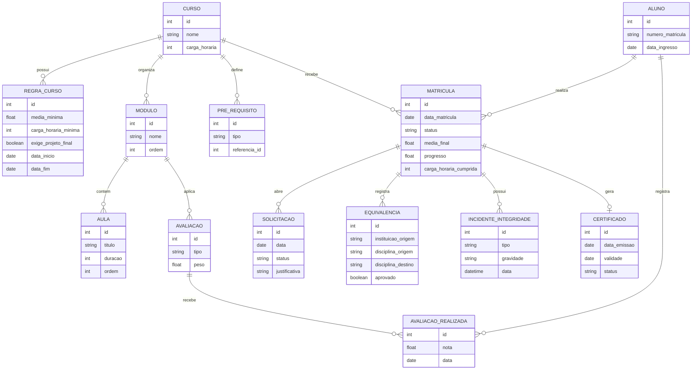

# Entrega Final do Projeto

## 1. Identificacao do projeto

- Nome do projeto: Plataforma de Ensino
- Integrantes do grupo: marco antonio feitosa, nathan lacerda, fernando
- Link do repositorio: https://github.com/marcoantonio567/plataforma_ensino.git
- Tecnologia utilizada: Python 3.12+, Django 6.0.3, SQLite, HTML/CSS e templates Django.
- Funcionalidade principal desenvolvida: plataforma de cursos online com catalogo de cursos, modulos, aulas, matriculas, avaliacoes, regras de conclusao, certificados e controle de integridade academica.

## 2. Descricao do case

O projeto resolve o problema de uma plataforma de ensino online que precisa controlar cursos com certificacao profissional. O sistema organiza cursos em modulos e aulas, permite a matricula de alunos, acompanha progresso, carga horaria e desempenho, registra avaliacoes, solicitacoes academicas, equivalencias, certificados e incidentes de integridade.

O ponto principal do negocio e garantir que o aluno so receba certificado quando cumprir a regra vigente da sua matricula: media minima, carga horaria minima, projeto final obrigatorio quando existir e ausencia de incidente grave de integridade academica.

## 3. Estado do projeto antes da analise externa

Antes da analise externa, o projeto ja possuia uma base funcional em Django, com apps separados para cursos, alunos, avaliacoes e certificados. Porem, o DDD ainda estava mais visivel na organizacao de pastas do que no modelo de dominio.

Os principais pontos que precisavam evoluir eram:

- organizar melhor a arquitetura em camadas DDD por modulo;
- enriquecer as models com comportamentos de dominio, nao apenas dados;
- reduzir regras espalhadas entre views, forms, services e ORM;
- proteger melhor as regras de matricula, avaliacao e certificacao;
- criar Value Objects para nota, carga horaria, progresso, ordem e numero de matricula;
- definir melhor Aggregates, Aggregate Roots, Repositories, Factories e Domain Services;
- padronizar a linguagem do dominio e documentar os termos principais.

## 4. Alteracoes realizadas pelo outro grupo

O arquivo `documents/CRITICA_DDD.md` apontou que o projeto estava no caminho certo, mas ainda precisava transformar a estrutura em um dominio mais protegido. As principais criticas foram:

- a linguagem ubiqua misturava portugues e ingles em alguns pontos;
- algumas entidades estavam anemicas e com pouco comportamento;
- havia obsessao por primitivos em conceitos como nota, progresso e carga horaria;
- os limites dos agregados nao estavam claros;
- `Matricula` precisava ser fortalecida como Aggregate Root;
- repositories deveriam representar agregados, e nao apenas operacoes tecnicas de banco;
- faltavam factories explicitas para criacoes com regra;
- domain services deveriam separar regras puras de services de aplicacao;
- algumas regras ainda podiam ser burladas por alteracao direta de campos;
- faltavam testes cobrindo invariantes importantes.

## 5. Avaliacao das alteracoes recebidas

Foram mantidas as sugestoes ligadas a protecao do dominio: criacao de Value Objects, fortalecimento de `Matricula`, definicao de aggregates, repositories por root, factories para `Aluno` e `Matricula`, e Domain Service para elegibilidade de certificado.

Foram modificadas as sugestoes sobre renomeacao total para ingles. Os pacotes Django continuam em ingles para evitar impacto em imports, migrations, URLs e configuracoes. Para manter a linguagem de negocio, os nomes exibidos e a documentacao usam os conceitos em portugues.

Foram rejeitadas mudancas que criariam padroes artificiais sem ganho claro, como factories para todos os objetos. O grupo manteve factories apenas onde a criacao possui regra relevante.

As decisoes foram tomadas para melhorar o DDD sem quebrar o funcionamento existente do Django e sem tornar o codigo mais complexo que o necessario.

## 6. Melhorias adicionais realizadas pelo grupo original

Desde a commit `4c65e18e3d18522c9c08a8133cab7d0ca859a1d9`, o grupo original implementou varias melhorias:

- documentacao de negocio, arquitetura, modulos, agregados, factories, repositories, domain services e regras protegidas;
- Value Objects para notas, progresso, carga horaria, ordem, duracao, media minima, media final e numero de matricula;
- metodos de dominio em `Curso`, `Modulo`, `Aula`, `Matricula`, `Solicitacao`, `Avaliacao`, `AvaliacaoRealizada` e `Certificado`;
- transicoes protegidas de status em matriculas, solicitacoes e certificados;
- `AlunoFactory` e `MatriculaFactory` para criacoes com regras;
- `AvaliadorElegibilidadeCertificado` como Domain Service de certificacao;
- repositories orientados a Aggregate Roots;
- registro da regra de curso vigente na matricula;
- validacao de emissao de certificado por media, carga horaria, projeto final e incidente grave;
- ampliacao dos testes automatizados para regras de matricula, avaliacao, cursos e certificacao.

## 7. Linguagem Ubiqua

| Termo | Significado |
|---|---|
| Aluno | Pessoa cadastrada que realiza cursos na plataforma. |
| Curso | Formacao oferecida pela plataforma. |
| Modulo | Parte organizada de um curso. |
| Aula | Unidade de conteudo dentro de um modulo. |
| Matricula | Vinculo entre aluno e curso. |
| Regra de Curso | Conjunto de criterios de conclusao valido em determinado periodo. |
| Regra Vigente | Regra usada para avaliar uma matricula conforme a data em que ela foi criada. |
| Avaliacao | Instrumento usado para medir desempenho. |
| Nota | Resultado numerico de uma avaliacao, entre 0 e 10. |
| Progresso | Percentual de conclusao da matricula. |
| Certificado | Documento emitido quando a matricula cumpre os criterios. |
| Incidente de Integridade | Evento academico que pode afetar a confianca da avaliacao ou certificacao. |
| Solicitacao | Pedido academico feito pelo aluno. |
| Equivalencia | Reconhecimento de estudo feito anteriormente. |

## 8. Modulos

| Modulo | Responsabilidade | Classes principais |
|---|---|---|
| `courses` | Catalogo de cursos, estrutura academica e regras de conclusao. | `Curso`, `Modulo`, `Aula`, `RegraCurso`, `PreRequisito` |
| `students` | Jornada academica do aluno, matriculas, progresso e solicitacoes. | `Aluno`, `Matricula`, `Solicitacao`, `Aproveitamento`, `SegundaChamada`, `RevisaoNota`, `Equivalencia` |
| `assessments` | Avaliacoes, tipos de prova, projetos praticos e notas. | `Avaliacao`, `AvaliacaoObjetiva`, `AvaliacaoDiscursiva`, `ProjetoPratico`, `ProvaMonitorada`, `AvaliacaoRealizada` |
| `certifications` | Certificacao, ciclo de vida do certificado e integridade academica. | `Certificado`, `IncidenteIntegridade` |

## 9. Entities

| Entity | Identidade | Responsabilidades | Comportamentos | Regras de negocio | Ciclo de vida | Justificativa |
|---|---|---|---|---|---|---|
| `Curso` | `id` | Representar uma formacao. | `adicionar_modulo`, `adicionar_aula`, `remover_modulo`, `regra_vigente`. | Carga horaria positiva e controle dos objetos internos. | Criado, atualizado, possui regras, modulos e aulas. | Tem identidade e estrutura propria. |
| `RegraCurso` | `id` | Guardar criterios de conclusao. | `esta_vigente`, `validar_periodo`, `exige_projeto`. | Media valida, periodo valido e carga horaria minima nao negativa. | Criada para um periodo e usada por matriculas. | Precisa ser historica e identificavel. |
| `Modulo` | `id` | Agrupar aulas dentro de um curso. | `adicionar_aula`, `reordenar`. | Ordem positiva e unica por curso. | Criado, reordenado e removido dentro do curso. | Possui identidade dentro da estrutura do curso. |
| `Aula` | `id` | Representar conteudo de aprendizado. | `reordenar`, `atualizar_conteudo`. | Duracao e ordem positivas. | Criada, atualizada e removida dentro de modulo. | Pode mudar conteudo sem perder identidade. |
| `PreRequisito` | `id` | Indicar curso ou modulo exigido. | `referencia_curso`, `referencia_modulo`. | Tipo deve ser curso ou modulo. | Criado e associado a um curso. | Representa uma exigencia propria. |
| `Aluno` | `id` | Representar estudante da plataforma. | `matricular`, `trancar_matricula`, solicitar pedidos academicos. | Numero de matricula valido e unico. | Criado a partir de usuario e participa de matriculas. | Tem identidade independente do curso. |
| `Matricula` | `id` | Controlar a jornada aluno-curso. | `cancelar`, `trancar`, `reativar`, `concluir`, `atualizar_progresso`, criar solicitacoes. | Status, progresso, media, carga horaria e regra vigente protegidos. | Ativa, trancada, cancelada ou concluida. | E o centro da jornada academica. |
| `Solicitacao` | `id` | Representar pedido academico. | `iniciar_analise`, `aprovar`, `rejeitar`. | Fluxo de status protegido. | Pendente, em analise, aprovada ou rejeitada. | Tem ciclo de analise proprio. |
| `Aproveitamento` | `id` | Pedido de aproveitamento de estudos. | Herda fluxo de `Solicitacao`. | Deve pertencer a matricula e modulo do curso. | Segue ciclo de solicitacao. | Especializa um pedido academico. |
| `SegundaChamada` | `id` | Pedido de nova oportunidade de avaliacao. | Herda fluxo de `Solicitacao`. | Avaliacao deve pertencer ao curso da matricula. | Segue ciclo de solicitacao. | Especializa um pedido academico. |
| `RevisaoNota` | `id` | Pedido de revisao de avaliacao. | Herda fluxo de `Solicitacao`. | Avaliacao deve pertencer ao curso da matricula. | Segue ciclo de solicitacao. | Especializa um pedido academico. |
| `Equivalencia` | `id` | Registrar reconhecimento de disciplina. | `aprovar`, `reprovar`. | Deve estar ligada a uma matricula. | Criada, aprovada ou reprovada. | Possui decisao academica propria. |
| `Avaliacao` | `id` | Representar avaliacao de um modulo. | `nota_ponderada`, `alterar_peso`. | Peso deve ser positivo. | Criada, aplicada e usada para resultados. | Tem identidade e tipo proprio. |
| `AvaliacaoRealizada` | `id` | Registrar nota de aluno em avaliacao. | `registrar_nota`, `nota_ponderada`, `foi_aprovada`. | Nota entre 0 e 10; uma realizacao por aluno e avaliacao. | Criada quando aluno realiza avaliacao. | Representa um resultado academico identificavel. |
| `Certificado` | `id` | Controlar certificacao da matricula. | `emitir`, `suspender`, `revogar`, `renovar`. | Emissao exige matricula elegivel e transicoes validas. | Emitido, suspenso ou revogado. | Possui ciclo de vida proprio apos a conclusao. |
| `IncidenteIntegridade` | `id` | Registrar violacao academica. | Registro de tipo e gravidade. | Incidente grave pode bloquear certificacao. | Criado durante analise academica. | Precisa ser historico e auditavel. |

## 10. Value Objects

| Value Object | Atributos | Validacoes e regras protegidas | Igualdade | Justificativa |
|---|---|---|---|---|
| `CargaHoraria` | `valor` inteiro | Deve ser maior que zero. | Por valor. | Representa quantidade de horas do curso. |
| `CargaHorariaMinima` | `valor` inteiro | Nao pode ser negativa. | Por valor. | Representa criterio minimo de conclusao. |
| `DuracaoAula` | `valor` inteiro | Deve ser maior que zero. | Por valor. | Representa duracao sem identidade propria. |
| `Ordem` | `valor` inteiro | Deve ser maior que zero. | Por valor. | Controla ordenacao de modulos e aulas. |
| `MediaMinima` | `valor` float | Deve estar entre 0 e 10. | Por valor. | Define criterio academico da regra do curso. |
| `Nota` | `valor` float | Deve estar entre 0 e 10. | Por valor. | Representa nota sem ciclo de vida proprio. |
| `NumeroMatricula` | `valor` texto | Formato `ALU` seguido de 4 a 12 letras ou numeros. | Por valor. | Identificador de negocio do aluno. |
| `PercentualProgresso` | `valor` float | Deve estar entre 0 e 100. | Por valor. | Representa progresso sem identidade. |
| `MediaFinal` | `valor` float | Deve estar entre 0 e 10. | Por valor. | Representa resultado final da matricula. |
| `CargaHorariaCumprida` | `valor` inteiro | Nao pode ser negativa. | Por valor. | Representa horas cumpridas na jornada. |

## 11. Aggregates e Aggregate Roots

| Aggregate | Aggregate Root | Objetos internos | Fronteira de consistencia | Invariantes | Operacoes controladas pela raiz | Objetos fora do Aggregate | Justificativa |
|---|---|---|---|---|---|---|---|
| Catalogo de Curso | `Curso` | `RegraCurso`, `Modulo`, `Aula`, `PreRequisito` | Estrutura e regras de oferta de um curso. | Carga horaria positiva, ordem positiva, duracao positiva e modulo pertencente ao curso. | Adicionar/remover modulo, adicionar/remover aula, obter regra vigente. | `Matricula`, `Avaliacao`, `Certificado`. | Modulos, aulas e regras so fazem sentido dentro de um curso. |
| Jornada Academica | `Matricula` | `Solicitacao`, `Aproveitamento`, `SegundaChamada`, `RevisaoNota`, `Equivalencia` | Relacao aluno-curso. | Status valido, progresso 0-100, media 0-10, regra do mesmo curso. | Cancelar, trancar, reativar, concluir, atualizar progresso e abrir solicitacoes. | `Curso`, `Avaliacao`, `Certificado`. | A matricula concentra o estado critico da jornada. |
| Avaliacao | `Avaliacao` | `AvaliacaoRealizada` | Definicao de avaliacao e resultado. | Peso positivo, nota entre 0 e 10, uma realizacao por aluno e avaliacao. | Alterar peso, calcular nota ponderada e registrar nota. | `Matricula`, `Certificado`. | Nota e peso pertencem ao processo avaliativo. |
| Certificacao | `Certificado` | Ciclo de status do certificado | Emissao, suspensao, renovacao e revogacao. | Certificado emitido exige matricula elegivel; revogado nao retorna a emitido. | Emitir, suspender, revogar e renovar. | `Matricula`, `IncidenteIntegridade`, `AvaliacaoRealizada`. | Certificado tem ciclo de vida proprio apos a conclusao. |

## 12. Factories

| Factory | Objetos criados | Regras aplicadas |
|---|---|---|
| `AlunoFactory` | `Aluno` | Exige usuario, gera ou valida `NumeroMatricula` e define data de ingresso. |
| `MatriculaFactory` | `Matricula` | Exige aluno e curso, busca regra vigente, rejeita curso sem regra e impede regra de outro curso. |

Nao foram criadas factories para todos os objetos porque muitos casos ja sao bem expressos por metodos de Aggregate Root ou por construtores simples.

## 13. Domain Services

O principal Domain Service e `AvaliadorElegibilidadeCertificado`, localizado em `certifications/domain/services.py`.

Ele valida se uma matricula pode receber certificado. Essa regra nao pertence naturalmente apenas a `Certificado`, porque depende tambem de `Matricula`, `RegraCurso`, projeto pratico concluido e incidentes de integridade. Por isso foi modelada como servico de dominio.

Os arquivos `application/services.py` continuam sendo Application Services, pois coordenam transacoes, repositories e fluxos de uso da aplicacao.

## 14. Repositories

| Aggregate persistido | Interface de dominio | Implementacao |
|---|---|---|
| `Curso` | `courses.domain.repositories.CourseRepository` | `courses.infrastructure.repositories.DjangoCourseRepository` |
| `Matricula` | `students.domain.repositories.EnrollmentRepository` | `students.infrastructure.repositories.DjangoEnrollmentRepository` |
| `Avaliacao` | `assessments.domain.repositories.AssessmentRepository` | `assessments.infrastructure.repositories.DjangoAssessmentRepository` |
| `Certificado` | `certifications.domain.repositories.CertificateRepository` | `certifications.infrastructure.repositories.DjangoCertificateRepository` |

As interfaces usam `Protocol` na camada de dominio. As implementacoes concretas ficam em `infrastructure`, isolando detalhes do Django ORM.

## 15. Regras de negocio

| Regra de negocio | Classe responsavel | Forma de protecao |
|---|---|---|
| Curso deve ter carga horaria positiva | `Curso`, `CargaHoraria` | `save()`, `clean()` e Value Object |
| Regra de curso deve ter media minima valida | `RegraCurso`, `MediaMinima` | `save()`, `clean()` e Value Object |
| Regra de curso nao pode terminar antes de iniciar | `RegraCurso` | `validar_periodo()` |
| Modulos e aulas devem ter ordem positiva | `Modulo`, `Aula`, `Ordem` | `save()`, `clean()` e Value Object |
| Aula deve ter duracao positiva | `Aula`, `DuracaoAula` | `save()`, `clean()` e Value Object |
| Matricula deve registrar regra vigente | `Matricula`, `MatriculaFactory` | Factory e `_validate_course_rule()` |
| Regra da matricula deve pertencer ao curso | `Matricula`, `MatriculaFactory` | Validacao da factory e do `save()` |
| Aluno nao pode duplicar matricula no mesmo curso | `Matricula` | `unique_together` |
| Status de matricula deve seguir fluxo valido | `Matricula` | `cancelar`, `trancar`, `reativar`, `concluir` e `_validate_status_transition()` |
| Progresso deve ficar entre 0 e 100 | `Matricula`, `PercentualProgresso` | `atualizar_progresso()`, `save()` e Value Object |
| Media final deve ficar entre 0 e 10 | `Matricula`, `MediaFinal` | `concluir()`, `save()` e Value Object |
| Solicitacao deve seguir fluxo de analise | `Solicitacao` | `iniciar_analise`, `aprovar`, `rejeitar` |
| Nota deve ficar entre 0 e 10 | `AvaliacaoRealizada`, `Nota` | `registrar_nota()`, `validate_grade()` e `save()` |
| Peso da avaliacao deve ser positivo | `Avaliacao` | `alterar_peso()` e `_validate_weight()` |
| Certificado so pode ser emitido para matricula elegivel | `AvaliadorElegibilidadeCertificado`, `Certificado` | `validar_emissao()` chamado no `save()` |
| Certificado possui ciclo de vida protegido | `Certificado` | `emitir`, `suspender`, `revogar`, `renovar` e `_validate_status_transition()` |
| Incidente grave bloqueia certificacao | `AvaliadorElegibilidadeCertificado` | Validacao de elegibilidade antes da emissao |

## 16. Aplicacao de Supple Design

O modelo ficou mais claro por usar metodos que revelam intencao de negocio, como `matricula.concluir()`, `matricula.cancelar()`, `certificado.revogar()`, `curso.adicionar_modulo()` e `avaliacao.alterar_peso()`.

Tambem foram aplicadas funcoes e objetos pequenos para reduzir ambiguidade: `Nota`, `MediaFinal`, `PercentualProgresso`, `CargaHoraria` e `NumeroMatricula` deixam as regras explicitas. As assertions aparecem em validacoes de `save()`, `clean()` e metodos de transicao, impedindo estados invalidos mesmo quando alguem tenta alterar campos diretamente.

## 17. Arquitetura final

O projeto usa DDD por app, mantendo cada modulo de negocio com suas proprias camadas:

```text
context/
|-- domain/
|-- application/
|-- infrastructure/
|-- presentation/
|-- models.py
|-- views.py
`-- admin.py
```

- Domain: contem Value Objects, policies, excecoes, contratos de repository e Domain Services.
- Application: contem casos de uso, transacoes e selectors de leitura.
- Infrastructure: contem implementacoes concretas com Django ORM.
- API/interface/apresentacao: contem views, forms, templates, rotas e interacao HTTP.

A dependencia esperada e `presentation -> application -> domain`, com infraestrutura implementando contratos definidos pelo dominio.

## 18. Diagrama do modelo de dominio



## 19. Testes e validacoes realizadas

Funcionalidades testadas:

- criacao e organizacao de cursos, modulos e aulas;
- validacao de carga horaria, duracao, ordem e regras de curso;
- criacao de aluno e matricula por factories;
- transicoes de matricula;
- validacao de nota e peso de avaliacao;
- emissao, suspensao, renovacao e revogacao de certificados;
- bloqueio de certificacao por media insuficiente, carga horaria insuficiente, projeto final pendente e incidente grave.

Testes automatizados existentes:

- `courses/tests.py`
- `students/tests.py`
- `assessments/tests.py`
- `certifications/tests.py`

Validacoes manuais realizadas:

- leitura das telas de cursos, modulos, aulas e matriculas;
- verificacao do fluxo de matricula e cancelamento;
- revisao das regras protegidas no dominio e nos arquivos de documentacao.

Procedimento recomendado:

```bash
python manage.py test
python manage.py migrate
python seed/seed.py
python manage.py runserver
```

## 20. Instrucoes para execucao

Pre-requisitos:

- Python 3.12+
- Git

Comandos:

```bash
git clone https://github.com/marcoantonio567/plataforma_ensino.git
cd plataforma_ensino

python -m venv venv
venv\Scripts\activate

pip install -r requirements.txt
python manage.py migrate
python seed/seed.py
python manage.py createsuperuser
python manage.py runserver
```

Acessos:

- Aplicacao: http://localhost:8000
- Admin: http://localhost:8000/admin

## 21. Limitacoes e trabalhos futuros

- algumas regras de pre-requisito ainda podem ser aprofundadas;
- avaliacoes objetivas, discursivas e monitoradas estao modeladas, mas podem ganhar fluxos de aplicacao mais completos;
- solicitacoes academicas podem receber telas e processos administrativos mais detalhados;
- a integridade academica pode evoluir para analise de evidencias;
- selectors e views ainda podem ser refinados para reduzir ainda mais o acesso direto ao ORM;
- o Admin Django pode receber protecoes especificas para impedir alteracoes manuais indevidas;
- o projeto pode ganhar mais testes de integracao e testes end-to-end.

## 22. Conclusao

Durante as commits recentes, o projeto evoluiu de uma aplicacao Django funcional para um monolito modular com maior orientacao a DDD. Foram aplicados conceitos como linguagem ubiqua, Entities com comportamento, Value Objects, Aggregates, Aggregate Roots, Factories, Repositories, Domain Services, invariantes e separacao de camadas.

A principal evolucao foi mover regras importantes para mais perto do dominio. Com isso, matriculas, avaliacoes, cursos e certificados passaram a proteger melhor seus estados e o sistema ficou mais expressivo, testavel e alinhado ao problema de negocio.
